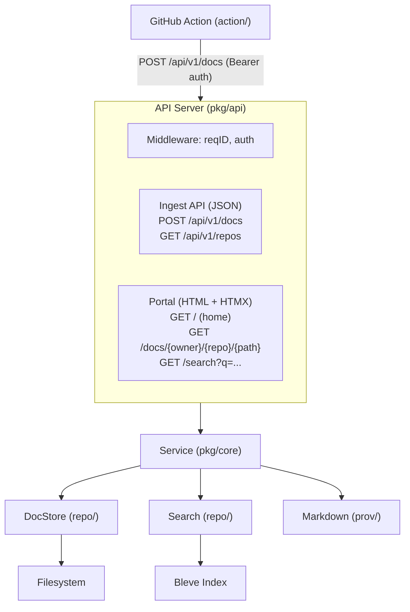
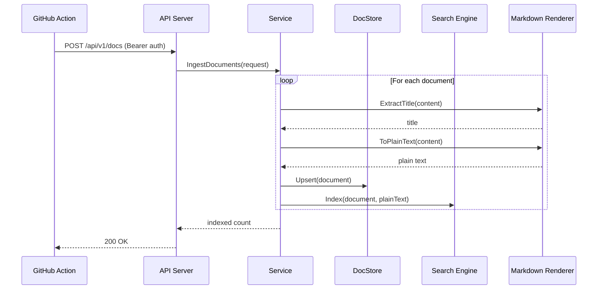
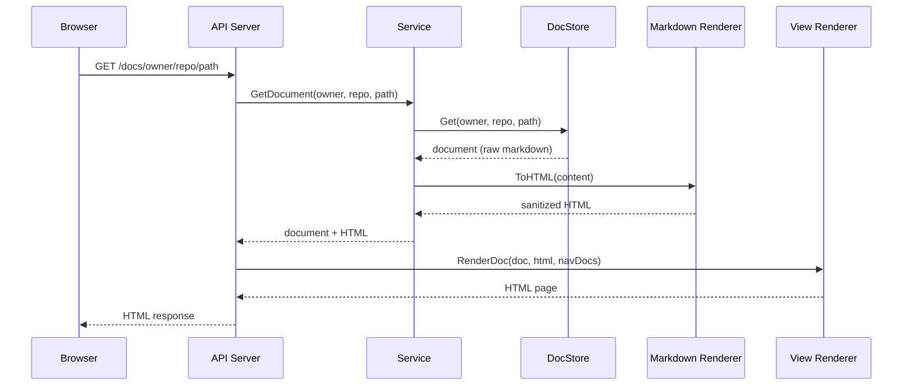

# Architecture Overview

Omnidex follows a clean architecture with clear separation of concerns. The application is built as a single Go binary with no external database dependencies.

## System Architecture

## Package Layout

| Package | Path | Responsibility |
|---------|------|----------------|
| **cmd** | `cmd/omnidex/` | Application entrypoint |
| **cli** | `pkg/cmd/` | CLI initialization, config loading, dependency wiring |
| **api** | `pkg/api/` | HTTP server, routing, handlers, middleware |
| **core** | `pkg/core/` | Business logic, domain types, service orchestration |
| **docstore** | `pkg/repo/docstore/` | Filesystem-based document storage |
| **search** | `pkg/repo/search/` | Full-text search engine (Bleve) |
| **markdown** | `pkg/prov/markdown/` | Markdown rendering and processing |
| **views** | `pkg/views/` | HTML template rendering for the portal |
| **action** | `action/` | GitHub Action for publishing docs |

## Request Flows

### Document Ingestion

### Document Viewing

## Key Design Decisions

### Embedded Search

Omnidex uses [Bleve](https://blevesearch.com/) as an embedded full-text search engine. This eliminates the need for external search infrastructure like Elasticsearch while still providing features like highlighted search results and relevance scoring.

### Filesystem Storage

Documents are stored directly on the filesystem with JSON metadata sidecars. This makes the system simple to deploy, backup, and debug. Each document is stored as two files:

- The markdown content file
- A `.meta.json` sidecar with title, commit SHA, and timestamp

### HTMX Portal

The web portal uses server-rendered HTML enhanced with [HTMX](https://htmx.org/) for SPA-like navigation without a JavaScript framework. Handlers detect HTMX requests via the `HX-Request` header and return either full pages or partial content fragments.

### Dependency Inversion

The core business logic defines its own interfaces (unexported) for storage, search, and rendering. Concrete implementations are injected during application startup in `pkg/cmd/server.go`. This keeps the core package free of infrastructure concerns and makes it easy to test with mocks.
